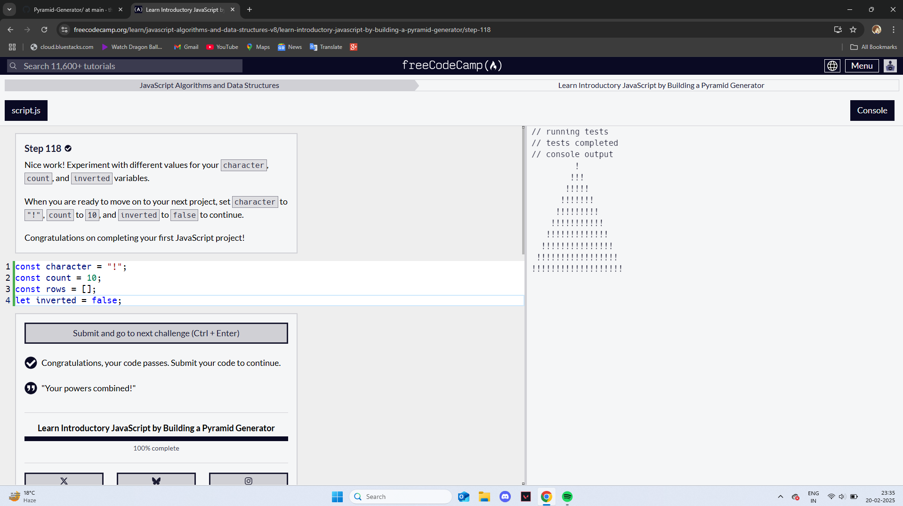

# Pyramid-Generator
Fundamental programming concepts in JavaScript to create Pyramid Generator.
In this project we will learn how to work with arrays, strings, functions, loops, if/else statements, and more. 
JavaScript is a powerful scripting language that you can use to make web pages interactive. It's one of the core technologies of the web, along with HTML and CSS. All modern browsers support JavaScript.

